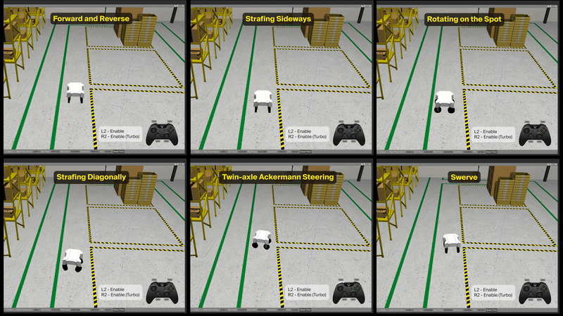

# Swerve Sim Container

Dockerized gazebo simulation of a swerve drive robot in the AWS Robomaker Small Warehouse World.




## What is a swerve-drive?

Swerve-drive is drive-train with independently steerable and driven wheels. This allows the robot to be omnidirectional. A swerve drive robot can spin on the spot, strafe sideways and perform more complex motions which are not possible with diff-drive or ackermann steering. Swerve-drive robots can have 3 or more wheels. This simulation exhibits a robot with four wheel independent steering.

For more details and derivation of swerve-drive kinematics and odometry, check out the [blog post](https://freshconsulting.com/insights/blog/how-to-build-a-swerve-drive-robot).

Watch the simulated [swerve-drive robot in action](https://youtu.be/0xqRzAWGigE) on Youtube.


## Dependencies

* [Docker](https://docs.docker.com/engine/install/ubuntu/)
* make (`$ sudo apt-get build-essential` on ubuntu)
* x11 (to run gazebo application windows)
* (Optional) - [Nvidia Container Toolkit](https://docs.nvidia.com/datacenter/cloud-native/container-toolkit/install-guide.html#installing-on-ubuntu-and-debian)


## Instructions to run

1. Clone the repo
    ```
    $ git clone https://github.com/freshrobotics/swerve-sim-container.git
    $ cd swerve-sim-container
    ```

2. Pull or Build sim image
    ```
    # Pull image from github container repository
    $ make pull
    ```

    ```
    # Locally build image
    $ make build
    ```

3. Launch sim
    ```
    # Without Nvidia GPU
    $ make launch
    ```

    ```
    # With Nvidia GPU
    $ make launch-gpu
    ```

4. (Optional) Launch teleop nodes
    ```
    # Keyboard Teleop
    $ make teleop-keyboard

    # Joystick Teleop
    $ make teleop-joy
    ```


## Additional Utilities
1. `make run` or `make run-gpu` - Run container with shell.
2. `make shell` - Attach shell to the running container.
3. `make stop` - Stop running container.


## License
This repo is Apache-2.0 licensed.

